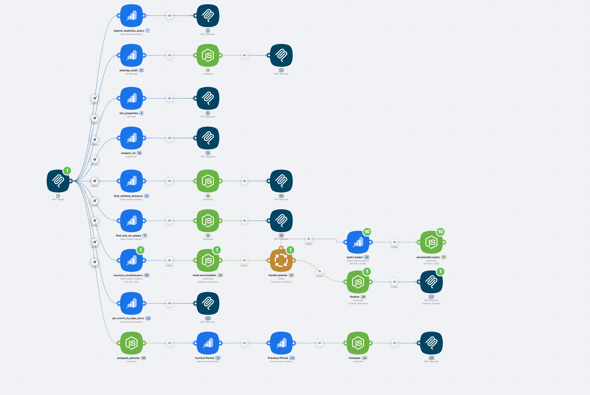
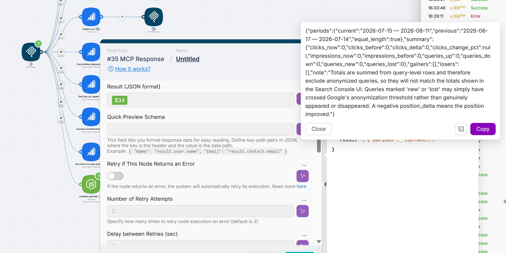
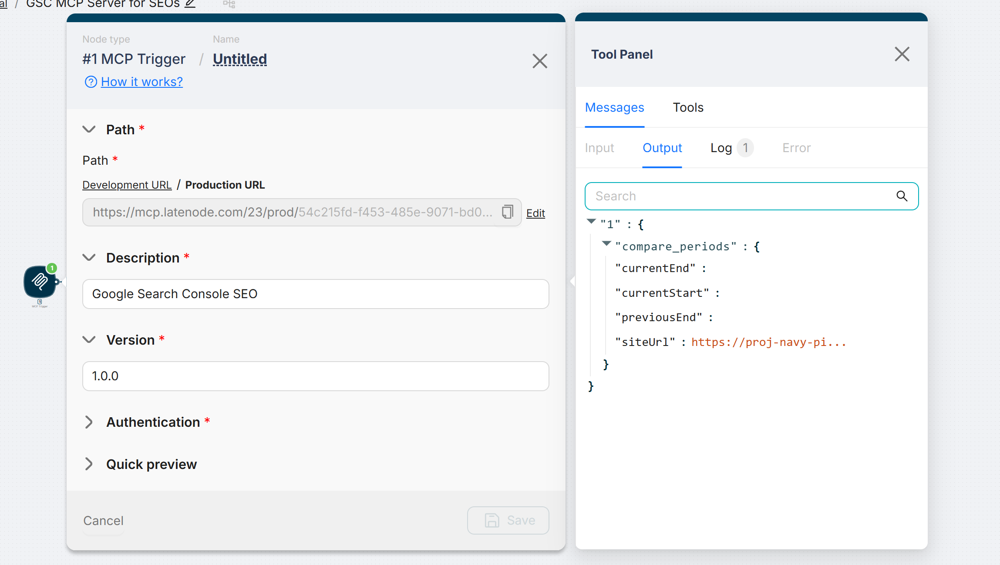

# Google Search Console MCP Server for SEOs

A hosted Model Context Protocol server for Google Search Console, shipped as an importable Latenode template. Ask your AI assistant about search performance in plain language - no Python, no Node, no Google Cloud project, no service-account keys, no terminal.

[](./LICENSE)
[](https://modelcontextprotocol.io)
[](#the-nine-tools)
[](https://latenode.com)

**[→ Open the template](https://app.latenode.com/templates/shared/6953b9645ad4cb8fc1ebe38c)**

Works with Claude Desktop, Claude on the web, Cursor, Codex CLI and ChatGPT. Because the server is hosted, it runs in the browser - not only in a desktop app.

---

## Why this exists

Most Search Console MCP servers are libraries you run yourself. Before asking a single question you install a runtime, create a Google Cloud project, configure an OAuth consent screen or service account, download a JSON key, and hand-edit a client config with absolute file paths.

This template removes all of it:

1. Import the scenario.
2. Connect Google in one click - the Latenode OAuth application is already verified, so there is no consent screen to configure and no key file to store.
3. Enable authorization on the MCP Trigger and copy the API key.
4. Copy the Production URL.
5. Paste both into your AI client.

Nothing runs on your machine.



---

## The nine tools

All tools are read-only. The four marked ⭐ answer questions the Search Console interface cannot answer directly.

| Tool | What it does | Ask your assistant |
|---|---|---|
| `list_properties` | Every property on the account with your permission level. | "Which sites do I have access to?" |
| `search_analytics_query` | Clicks, impressions, CTR and average position, grouped by query, page, country, device or date, with filtering and pagination. | "Show my top 20 queries for last month." |
| `compare_periods` ⭐ | Compares two date ranges and returns what grew and what declined, with per-query deltas and ranked lists of gainers and losers. | "What changed since last month?" |
| `get_search_by_page_query` | Every query bringing traffic to one specific page. | "What keywords bring traffic to my pricing page?" |
| `find_striking_distance` ⭐ | Queries in positions 8-20 with impressions but few clicks - the ones closest to breaking through. | "What should I optimise first?" |
| `find_low_ctr_pages` ⭐ | Pages whose CTR falls below the benchmark for their average position. | "Why do these pages get impressions but no clicks?" |
| `keyword_cannibalization` ⭐ | Queries where several of your own pages compete, and which one Google favours. | "Are my pages competing with each other?" |
| `inspect_url` | Index status for one URL: coverage state, last crawl, canonical, mobile usability. | "Is this page indexed?" |
| `sitemap_audit` | All sitemaps with errors, warnings and dates, plus a list of the ones needing attention. | "Is anything broken in my sitemaps?" |

### How the analytical tools work

**`compare_periods`** resolves the dates itself. Leave out the end of the current period and it uses today minus three days to allow for reporting lag; leave out the start and it counts back 28 days; name only one period and it takes an equally long stretch immediately before it. Both requests are locked to final data, so a partial recent day cannot manufacture a decline. Queries are labelled `up`, `down`, `flat`, `new` or `lost`, and anything under ten impressions in both periods is discarded as noise.



**`find_striking_distance`** selects positions 8 to 20 with at least 50 impressions, estimates the clicks being left on the table, and returns the top 50 ranked by that estimate.

**`find_low_ctr_pages`** compares actual CTR against a benchmark by position - roughly 28% at position one, 15% at two, 11% at three, tapering to about 1% beyond the first page - and returns pages with at least 100 impressions that fall short.

**`keyword_cannibalization`** works in two stages, because the query-and-page combination exceeds the row limit on a large site. It takes the 50 queries with the most impressions, then asks Search Console which pages rank for each one, up to 25 pages per query. The ceiling is 51 API calls per invocation. Watch the `conflict` field: it is true when the best-ranking page is not the page earning the most clicks, which is the real signal that Google is hesitating between your pages.

---

## Setup

### 1. Check your Search Console permissions

| Role | What works |
|---|---|
| Restricted user | Analytics, comparisons, striking distance, low CTR, cannibalization |
| Full user | All of the above, plus URL inspection and sitemaps |
| Owner | Everything |

Full user is the practical minimum.

### 2. Import the template

Two ways to get the scenario into your workspace.

**From the shared template (recommended).** Open the [template on Latenode](https://app.latenode.com/templates/shared/6953b9645ad4cb8fc1ebe38c) and import it. You always get the current version.

**From the JSON export in this repository.** Download [`scenario/gsc-mcp-server.json`](./scenario/gsc-mcp-server.json), then create a scenario in Latenode and import the file. Use this if you want to inspect the scenario before importing, pin a specific version, or track your own modifications in git.

The export ships with placeholders instead of live values: `{{#YOUR_GOOGLE_SEARCH_CONSOLE_CONNECTION}}` for the Google connection and an empty MCP Trigger path. Both are filled in during the next two steps.

### 3. Connect Google

Open any Google Search Console node, click **Connect** in the Connection field, choose an account with access to your property and approve. Do this once - every node shares the connection.

### 4. Turn on authorization and copy the address

On the **MCP Trigger** node:

1. Expand **Authentication**, switch it on and save the generated API key.
2. In the **Path** section, switch from Development URL to **Production URL**.
3. Copy the address.



Development URL is for testing while you edit the scenario. Clients you intend to keep using should point at the Production URL.

### 5. Activate

Save the scenario and switch it to **Active**.

### 6. Connect your client

Replace `SERVER_URL` and `API_KEY` with your own values.

**Claude Desktop** - `claude_desktop_config.json`

```json
{
  "mcpServers": {
    "gsc": {
      "type": "http",
      "url": "SERVER_URL",
      "headers": { "Authorization": "Bearer API_KEY" }
    }
  }
}
```

Quit the app completely and reopen it.

**Claude on the web** - Settings → Connectors → Add custom connector → paste the address and key.

**Cursor** - `~/.cursor/mcp.json`

```json
{
  "mcpServers": {
    "gsc": {
      "url": "SERVER_URL",
      "headers": { "Authorization": "Bearer API_KEY" }
    }
  }
}
```

**Codex CLI** - `~/.codex/config.toml`

```toml
[mcp_servers.gsc]
url = "SERVER_URL"

[mcp_servers.gsc.http_headers]
authorization = "Bearer API_KEY"
```

**ChatGPT** - Settings → enable Developer mode → Connectors → add the address.

> ChatGPT rejects credentials placed in the URL query string. Supply the key in the authentication field. If your MCP Trigger only accepts the key as a URL parameter, disable authorization on the trigger and connect without authentication - and treat the resulting address as a secret.

### 7. Test

Ask your assistant: **List my GSC properties.** If your sites come back, you are live.

---

## Reading the results

**Position deltas.** A negative `position_delta` means the position improved, because the rank number got smaller.

**New and lost queries.** Google withholds rare queries to protect privacy, and the threshold shifts between periods. A query labelled `new` or `lost` may simply have crossed that threshold rather than genuinely appeared or vanished. Trust the gainers and losers lists over the counts.

**Missed-click estimates.** The figures in striking distance and low-CTR results size the opportunity for prioritisation. They are not forecasts.

**The `conflict` flag.** Several pages ranking for one query is normal and usually needs no action. The flag isolates the case worth investigating.

---

## Limitations

These come from Search Console itself, not from the template.

- **Data lags two to four days.** There is no live view.
- **Some queries are hidden.** Per-row sums will not match the totals in the Search Console interface.
- **Average position is impression-weighted**, not your current rank.
- **History stops at 16 months.** Older data is deleted permanently.
- **A single response holds 25,000 rows at most**, ordered by clicks. On large sites the long tail does not appear.
- **URL inspection is capped at 2,000 URLs per property per day.**
- **Cannibalization covers the top 50 queries by impressions**, not the whole site.

---

## How this compares to self-hosted servers

Other projects are open source and well built; they make a different trade-off.

| | This template | Typical self-hosted server |
|---|---|---|
| Local install | None | Runtime plus package manager |
| Google setup | One click, pre-verified OAuth | Your own Cloud project, OAuth or service account, key file |
| Client config | Paste an address and key | Absolute file paths |
| Browser Claude and ChatGPT | Yes | No, unless you host a remote endpoint yourself |
| Scheduling and alerts | Available through Latenode scenarios | Not built in |
| Where data flows | Through your Latenode workspace | On your own machine |
| Customization | Visual editor | Fork the source |

Choose a self-hosted server if you want the data path entirely on your own hardware or you intend to modify the source. Choose this template if you want zero setup and browser support.

---

## What is intentionally excluded

Adding a site, deleting a site and deleting a sitemap are not exposed as tools. They are irreversible, and the risk of an assistant triggering one on an ambiguous phrasing outweighs the convenience. Submitting a sitemap is planned for a later iteration.

---

## Roadmap

- Batch URL inspection
- Traffic-drop diagnostics separating ranking loss from CTR decline
- Hourly data for monitoring fresh content
- Discover and Google News performance
- Google Analytics linkage for conversion analysis
- Submit sitemap, opt-in

---

## What is in this repository

| Path | Contents |
|---|---|
| [`scenario/gsc-mcp-server.json`](./scenario/gsc-mcp-server.json) | The full scenario export - 30 nodes, 9 tools. Import this into Latenode, or read it to see exactly what each tool does before you run anything. Credentials and workspace identifiers have been replaced with placeholders. |
| [`docs/tools.md`](./docs/tools.md) | Parameter reference for all nine tools: which values the assistant supplies, which are fixed in the scenario, and the thresholds behind each calculation. |
| [`assets/`](./assets) | Screenshots used in this README. |

## Contributing

Issues and pull requests are welcome - bug reports, prompt recipes and ideas for new read-only tools especially.

Never commit real connection identifiers, API keys, server addresses or email addresses in scenario exports or screenshots. The export in this repository has been scrubbed; keep it that way.

## License

Released under the [MIT License](./LICENSE).

In practice this means you can use this template commercially, modify it, fold it into your own product and redistribute it, for free and without asking. The only condition is that you keep the copyright notice. It also comes with no warranty: if a tool misreads your data, that is on you to verify.

The license covers what is in this repository - the scenario export and the documentation. It does not cover the Latenode platform itself, which has its own terms, or your Search Console data, which stays yours.

## Links

- [Template on Latenode](https://app.latenode.com/templates/shared/6953b9645ad4cb8fc1ebe38c)
- [Latenode MCP documentation](https://documentation.latenode.com/integrations/mcp/mcp-nodes)
- [Model Context Protocol](https://modelcontextprotocol.io)
